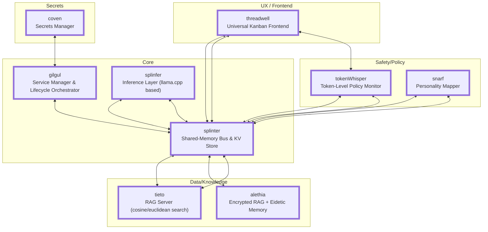

# Runa: A Microkernel-Inspired System for Local LLM Deployment

Runa is a self-contained, micro kernel style orchestration layer for deploying
large language models (LLMs) locally — entirely offline, fully under user
control, and built with safety, transparency, auditability and modularity at 
its core.

Runa enables immersive, safe, and private experiences with conversational models
on everything from aging Chromebooks to modern desktops. It augments your model
of choice with optional retrieval, classification, policy enforcement, and user
interfaces, while staying small, understandable, and repairable.

A cluster of processes, binaries, scripts and files, Runa is designed to be
deployed on a minimal Linux/GNU virtual machine or as a container in any modern
runtime. This provides solid CPU usage confinement as well as air-gapped use of
backing storage and resources.

Runa will run well in a chroot, but may consume most available CPU during
generation because VM limits won't be present to prevent it. As a very last
resort, Runa can be installed over top of most modern Debian or Fedora based
GNU/Linux distributions.

## System Requirements

Minimum:

- i3 (11th gen +)
- 6GB RAM
- 25 GB Storage
- Debian 12 / Ubuntu 24
- Fedora requires a VM or there are zero CPU and RAM limits for the models.
  (cgroups integration is only even close to stable on Debian flavors and 
  even that's weeks from shipping. VM strongly recommended.)

Recommended:

- i5 +
- 16 GB RAM
- 256 GB SSD

Best Experience:

- i7 +
- 32 GB RAM
- Entry-level (or better) GPU

Runa is working on its own inference layer that is optimized for constrained 
space use cases; "More Meat" won't always translate into better performance.
We're more concerned with enabling the best experience in limited spaces for
high-quality quantized models. This means embracing things like RWKV in model
architecture as early and quickly as we can. 

Even though RWKV lives in the model, the inference layer can help
with things like state handling, batching, quantization and better device 
memory management than would be expected with multi-head dot product attention 
systems so that the benefits are quickly felt in places where they're 
disproportionately felt.

Since Runa is designed around a whole ecosystem of open source models of various
ages, a lot of our integration relies on strong system prompt crafting and
adherence. This means we run *very* fast toward technologies that solve the 
constraint problems in a way that isn't throwing more RAM and GPU at them.

While RWKV's benefits are most apparent during training, they're also exponentially
present in the resources that quantized models require during inference. Work
like this is prioritized over better GPU support (or RAM configurations over 128
GB). 

## Design Principles

- **Offline-first**: Operates without any internet connection.
- **Componentized**: Isolates responsibilities into swappable units.
- **Privacy-respecting**: No tracking, telemetry, or external APIs.
- **Portable**: Runs in `chroot`, VM, or bare-metal on Debian/Fedora.
- **Recoverable**: Inspired by Minix3, HURD, and [HelenOS][9] for resilience.
- **Simple Contracts**: Do one thing, very well, with as few reasons to change as possible.

## Architecture Overview

Runa is a micro kernel inspired platform for deploying and coordinating local
large language model experiences in a modular, private, and resilient fashion.

This document outlines the system architecture and how its components interact
at both a runtime and systems level.

Name resulted from needing "A runtime" and "_Arun_" just didn't roll off the
tongue so well, so _Runa_ it became. Runa's [reason for existing][8] is also kind 
of interesting, if you want to check it out. 

But let's get down to the nitty gritty:

## Core Components

### Component Breakdown

Each component is a process owned by the user/group _runa_, which has (approx)
80% of root's privileges when it comes to CPU, RAM and file descriptor usage.

The idea is to avoid the scenario where running a component as root just to
bypass configurable limits (because let's face it, they're onerous as hell to
set up) seems like the best idea.

#### `libsplinter`

- Shared-memory message bus and KV store.
- Message routing layer with decay, observability, and component-level stats.
- Serves as the central coordination plane for all components.
- Currently in development ([repo][]).
- Current focus:
  - Janitorial (automating TS bindings, doc gen)
  - Instrumentation and observability tools (a scope)
  - Encryption (payload), keys-by-hash scheme (plain text keys get hashed)
    before being saved, keys show up as one-way hashes a secret is required to
    create, and/or, All keys are UUIDs FTW! scheme. Could be on a per-bus basis
    and part of the metadata. This is needed for `coven`and `alethia` (see
    below).

#### `tieto`

- RAG server with cosine similarity over JSONL documents.
- Euclidean distance also calculated to narrow or filter results.
- Modes: Retrieval-only or full-completion (prompt + model eval).
- Frontmatter-aware with query filtering (`=`, `<=`, `>=`, `in`).
- Embedding support via CPU-friendly `llama.cpp` variant.
- Currently in development ([repo][2]).
- Current focus:
  - Proper-izing as a class and library
  - Adding binary indexing with goals of eventually supporting:
    - Vector quantization (e.g. IVF, HNSW, product quantization)
    - K-means clustering (coarse buckets)
    - Approximate nearest neighbor (ANN) search

#### `threadwell`

- Shoelace + SortableJS + Deno Universal Kanban Frontend For Runa implemented
  purely in HTML components + JavaScript with Deno for splinter message bus
  integration.
- Is being designed to handle prompt, personality and other data to use
  highly-capable 8B quantized models in very versatile ways, from corporate SOP
  agents to personal assistants to translators to transcribers to researchers:
  cards provide a great base for many useful things to begin in familiar, easy
  JS and HTML.
- Also provides Oak-based APIs to enable integrations with things like slack,
  discord, notion and other things that can take advantage of an API.
- Needed something that could "thread well" (as in be a front end for many
  things simultaneously) and the name stuck.
- Currently in development ([repo][3])
- Current focus:
  - Oak back-ends
  - Simple turn-based chat plugin

#### `gilgul`

- Runa's service manager and lifecycle orchestrator.
- Inspired by the Minix3 reincarnation server.
- Designed for resilience and health-aware orchestration.
- Designed for use by underprivileged non-root users (similar to systemd)
- Kabbalistic concept of reincarnation / transmigration. 
- Should be ready late September 2025.

#### `tokenWhisper` / `safeSequence`

- Designed to run fast: inline in any LLM pipeline, or as a sidecar monitor.
- Token-level policy enforcement and monitoring.
- Uses a Token Impact Matrix to detect violations and guide control flows.
- Detects pattern-based violations (e.g., jailbreaks, policy circumvention).
- Can escalate to further checks or redirect response generation.
- Currently in design / research ([design doc][5]).

#### `snarf`

- Passive personality mapper.
- Learns over time then adapts based on changes.
- Designing toward better safety for neurodivergent users.
- Currently in design / research ([design doc][6]).

#### `splinFer`

- Runtime based on `llama.cpp` shared libraries (uses the same functions as
  llama-cli and llama-server)
- Uses splinter for short-term working memory as well as communication with
  other components over splinter (hence the name)
- Uses the same parameter syntax as llama.cpp, for ease of reference
- Runs in foreground or daemon
- Only talks to the bus (no console I/O), but otherwise carries on simultaneous
  turn-based conversations using different persona settings.
- Is easy to build, very difficult to design. 
- Current project development focus (what Tim is working on, mostly, right now).
- Looks like it's coming together in Rust.

#### `alethia`

- Greek for “truth,” also the act of unforgetting or bringing into light.
- Encrypted version of Tieto + indexing
- Can hold a very fast index of every book in a public library in just under
  256mb; decrypts and retrieves based on index matches.
- Decrypts matches on-demand and transmits them over a dedicated bus
- Specifically written for local LLMs to have an eidetic memory of every
  interaction they've had with their user + linked feedback from it that can be
  used to re-train or re-orient context.
- Can also be used as the base for a very capable document store.
- 100% local, 100% encrypted, as easy to snapshot and rotate as Tieto.
- Available under dual license on request.
- Will be ready as soon as Tieto's cluster indexing is done (Late 2025).

#### `coven`

- Secrets manager
- Trusts gilgul only; knows it because it starts gilgul (required to use Coven).
- gilgul enforces policy, coven decrypts on-the-fly and provides response.
- Uses separate bus shared only with gilgul.
- Gilgul monitors coven; multiple options on failure are possible.
- Lower priority as far as development attention goes.

## Memory Subsystem

Runa is designed with [several kinds of memory][7] to help it offer personality and 
familiarity continuance and consistency with its users. Below is a quick summary:

 - Ephemeral memory, which uses `libsplinter` keys that are naturally evicted over time if 
   not used. Those that persist find their way into Tieto.
 - Short-term memory / current events memory, which uses `tieto`. 
 - Based on dream cycles and settings, tieto artifacts that are frequently accessed over
   time as well as chat conversation history find their way into `alethia`, which is 
   signed.

Another model that isn't connected to Runa looks at memory of the day's events to look for
bias in output, personality drifting on the part of the model or user and other things like
information frequency, repeating tokens, etc. While the components are well underway (some of
them close to done), the orchestration is still under development; Tim expects to have it 
test-able by the end of 2025.

## Inter-Component Protocol

See the [splinter base protocol docs][4] for the current envelope protocol. Of course, it
is subject to change as encryption is increasingly supported.

## Development Principles

There are some things that guide decisions about how Runa works, what future
needs are going to be, and what should be prioritized. Here they are:

- **Trust & Safety First**:
  People can always install whatever they want; it's their computer after all. But,
  when it comes to the Runa core / base:

  - We're safety and privacy focused! We understand that our users might use
    Runa when they're at their most vulnerable, so we put extra diligence into
    privacy and safety.
  - No telemetry, ever. No cloud, ever. No ads, ever. Users can add whatever
    they want; we don't install anything that connects to the outside world
    without their explicit, informed permission.
  - We test, rigorously. Changes to the inference layer, prompts, token matrix
    or context recall (memory) must pass
- **Auditability**: Logs, bus messages, token-level context.
- **Modularity**: Replace any component. Nothing is tightly coupled.
- **Self-healing**: System should diagnose and repair itself whenever possible.

But the biggest one is last: _**Do. No. Harm.**_ We don't present illusions of
safety we can't back up with data. We have to optimize for the most vulnerable
of our users with something like Runa as safety and privacy are so very
important.

  [1]: https://github.com/timthepost/libsplinter
  [2]: https://github.com/timthepost/tieto
  [3]: https://github.com/timthepost/threadwell
  [4]: https://github.com/timthepost/libsplinter/blob/main/docs/base-protocol.md
  [5]: https://github.com/timthepost/runa/blob/main/docs/token_whisper.md
  [6]: https://github.com/timthepost/runa/blob/main/docs/personality_mapping.md
  [7]: https://github.com/timthepost/runa/blob/main/docs/memory_architecture.md
  [8]: https://github.com/timthepost/runa/blob/main/motivation.md
  [9]: https://helenos.org

