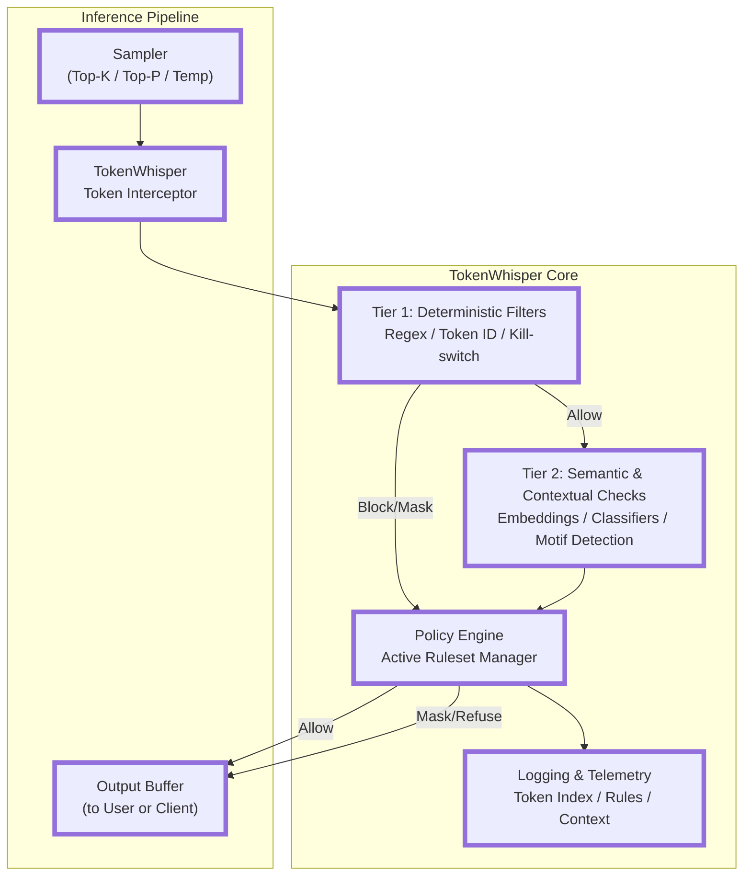

# TokenWhisper – Detailed Design & Functionality Overview

## Purpose

TokenWhisper is a **token-level, inference-layer safety and monitoring
framework** for LLMs.\
It is intended to:

1. **Intercept** model output at the token level during inference.
2. **Analyze** generated tokens in real time for policy violations, abuse
   vectors, or unsafe emerging motifs.
3. **Respond** by allowing, modifying, blocking, or flagging output before it
   reaches the end user.
4. **Adapt** to different policy contexts dynamically (e.g., per customer, per
   conversation, per mode).

The idea is to be **low-latency, model-agnostic**, and work in both **local
inference stacks** (llama.cpp, vLLM, etc.) and API-proxy configurations.

---

## Core Design Principles

1. **Token-Level Granularity** – Decisions are made _before_ the full sentence
   or paragraph is produced, so problems can be prevented instead of reacted to
   afterward.
2. **Minimal Intrusion** – The system avoids heavy processing in the hot path.
   Safety checks must run with microsecond-level overhead.
3. **Layered Safeguards** – Safety logic is split into fast deterministic
   filters and slower, context-sensitive evaluators.
4. **Model Independence** – Works on top of any model backend, as long as token
   streaming is supported.
5. **Configurable Policy Sets** – Operators can define different safety rulesets
   for different situations (e.g., child-safe mode, research mode, unrestricted
   dev mode).
6. **Explainability & Auditability** – Every intervention is logged with token
   indexes, matched rules, and reasoning.

---

## Architecture

## TokenWhisper – Architecture Diagram

### 1. Token Interceptor

- Hooks into the inference stream **between the sampler and output buffer**.
- Receives the **current token**, its **index**, and the **full context** up to
  that point.
- Feeds this into the **analysis pipeline**.

### 2. Analysis Pipeline

The core safety checks run here, in two tiers:

#### Tier 1: Deterministic Filters

- **Regex / exact phrase matches** for known unsafe patterns.
- **Token ID sets** for “banned” sequences (e.g., slurs, profanity, sensitive
  PII markers).
- **Stop-word / kill-switch tokens** that immediately halt generation.
- Operates **inline** with negligible delay.

#### Tier 2: Semantic & Contextual Checks

- **Embedding similarity search** against a curated unsafe-content vector
  database.
- **Lightweight classifier models** (e.g., distilled safety models) for
  higher-level pattern recognition.
- **Emergent motif detection** – monitors for suspicious build-up (e.g.,
  grooming patterns, disallowed instruction chains).
- May run asynchronously in a _shadow process_ for speed, signaling “block”
  events if a pattern emerges.

---

### 3. Policy Engine

- Maintains **active safety ruleset**.
- Can switch **mid-conversation** (e.g., elevated restrictions when a high-risk
  topic emerges).
- Policies can define:
  - **Block** – stop generation immediately.
  - **Mask** – replace offending token(s) with safe alternatives.
  - **Delay / Review** – pause output until approved by a human or secondary
    system.
  - **Flag** – allow but log for later review.

---

### 4. Response Actions

When a violation is detected:

- **Hard Stop:** Ends generation, possibly replacing with a refusal or safe
  message.
- **Soft Mask:** Substitutes tokens with `[REDACTED]` or semantically equivalent
  safe text.
- **Content Reshape:** Adjusts generation path using steering tokens or prompt
  injection _back into_ the model mid-stream.

---

### 5. Logging & Telemetry

- Every intercepted token has:
  - **Token index**
  - **Text**
  - **Matched rule(s)**
  - **Policy decision**
  - **Context snippet**
- Supports **binary logging** for replay (to retrain safety models or debug).
- Option for **real-time dashboard** to visualize token flow & interventions.

---

## Example Flow

1. Model starts generating: "How to make a bomb is..."
2. **Tier 1** sees `"bomb"` (in banned terms list) → triggers Tier 2.
3. **Tier 2** checks context embedding → matches with "illegal weapons
   instructions" vector cluster.
4. Policy engine says: `"Block"` for this category.
5. Output to user becomes: "I cannot provide instructions for that."
6. Event logged for auditing.

---

## SafeSequence Integration

TokenWhisper is designed to integrate with **SafeSequence** (formerly
TokenFence):

- **SafeSequence** handles _structured safety checks_ (e.g., grammar/state
  machine rules for multi-turn exploits).
- **TokenWhisper** handles _low-level token monitoring and immediate
  intervention_.
- Together:
- TokenWhisper = **real-time guardrail**
- SafeSequence = **policy-aware pathing & state validation**

---

## Use Cases

- **Local AI safety** for on-device assistants.
- **Content moderation** for AI-powered chatbots & games.
- **Corporate compliance** – ensure no generated text violates internal policy.
- **Multi-tenant SaaS** – per-client safety policy enforcement.
